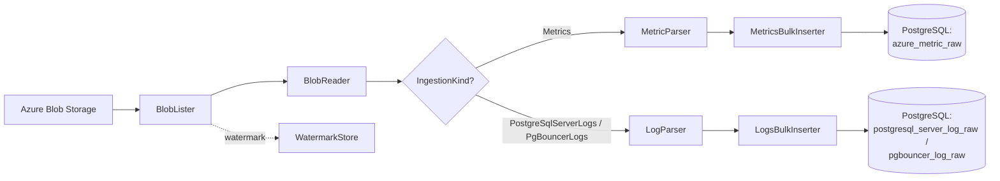

# PgSqlDiagnosticCollector

Utility ingestion .NET 8 yang membaca file diagnostik Azure Database for PostgreSQL Flexible Server dari Azure Blob Storage, mem-*parse*-nya, lalu memuat hasilnya ke database PostgreSQL konsolidasi (Azure Database for PostgreSQL). Program mendukung tiga jenis sumber data: **Metrics**, **PostgreSQL Server Logs**, dan **PgBouncer Logs**.

---

## Daftar Isi

- [Arsitektur Singkat](#arsitektur-singkat)
- [Jenis Ingestion (IngestionKind)](#jenis-ingestion-ingestionkind)
- [Alur Pipeline](#alur-pipeline)
- [Fitur: Parsing AllMetrics](#fitur-parsing-allmetrics)
- [Fitur: Parsing PostgreSQL Logs](#fitur-parsing-postgresql-logs)
- [Verifikasi: Penanganan PgBouncer Logs](#verifikasi-penanganan-pgbouncer-logs)
- [Skema Tabel Tujuan](#skema-tabel-tujuan)
- [Konfigurasi & Cara Menjalankan](#konfigurasi--cara-menjalankan)
- [Deduplikasi & Watermark](#deduplikasi--watermark)

---

## Arsitektur Singkat



| Komponen | Tanggung Jawab |
|---|---|
| `Storage/BlobLister.cs` | Mendaftar blob yang memenuhi syarat (di atas watermark, di bawah *stabilization lag*). |
| `Storage/BlobReader.cs` | Mengunduh isi blob sebagai teks. |
| `Parsing/MetricParser.cs` | Mem-*parse* file metrics ke `MetricRow`. |
| `Parsing/LogParser.cs` | Mem-*parse* file log (PostgreSQL & PgBouncer) ke `LogRawRow`. |
| `Parsing/JsonHelpers.cs` | Utilitas bersama: baca field, flatten payload, split JSON, parse timestamp. |
| `Database/MetricsBulkInserter.cs` | Bulk load metrics via `COPY` + deduplikasi. |
| `Database/LogsBulkInserter.cs` | Bulk load logs via `COPY` + deduplikasi. |
| `Database/SqlDestination.cs` | Resolusi/pembuatan tabel tujuan & penambahan kolom yang diperlukan. |
| `Storage/WatermarkStore.cs` | Menyimpan posisi terakhir yang diproses per pipeline. |

---

## Jenis Ingestion (IngestionKind)

Didefinisikan di `Models/IngestionKind.cs`:

| Kind | Nilai argumen `--kind` | Container default | Tabel tujuan |
|---|---|---|---|
| `Metrics` | `metrics` | `insights-metrics-pt1m` | `azure_metric_raw` |
| `PostgreSqlServerLogs` | `postgresqllogs` | `insights-logs-postgresqllogs` | `postgresql_server_log_raw` |
| `PgBouncerLogs` | `pgbouncerlogs` | `insights-logs-postgresqlflexpgbouncer` | `pgbouncer_log_raw` |
| `AllLogs` | `alllogs` | (menjalankan PostgreSQL **dan** PgBouncer) | keduanya |

---

## Alur Pipeline

1. `Program.Main` mem-*parse* argumen/environment (`IngestionOptions.Parse`).
2. Jika `kind = alllogs`, dua pipeline dijalankan berurutan: PostgreSQL logs lalu PgBouncer logs, masing-masing dengan watermark terpisah.
3. `RunSinglePipelineAsync` untuk tiap pipeline:
   - Baca watermark terakhir.
   - Resolusi tabel tujuan (`SqlDestination.ResolveAsync`) + pastikan kolom lengkap (`EnsureRequiredColumnsAsync`).
   - Daftar blob yang memenuhi syarat (`BlobLister`).
   - Untuk tiap blob: parse → bulk insert → update watermark.

---

## Fitur: Parsing AllMetrics

Diproses oleh `Parsing/MetricParser.cs`. Sumber tipikal: file `AllMetrics-PT1H.json` (lihat `Sample/AllMetrics-PT1H.json`).

### Format yang Didukung

- **JSON** — array, objek dengan properti pembungkus (`records`, `value`, `metrics`, `timeseries`, dst.), atau **NDJSON** (satu objek JSON per baris). NDJSON ditangani lewat mekanisme *fallback* `JsonHelpers.SplitTopLevelJsonValues` saat parse dokumen tunggal gagal.
- **Delimited** — CSV/TSV (auto-deteksi delimiter).

### Contoh Baris Input

```json
{ "count": 2, "total": 6.51648066373567, "minimum": 3.1493145609485, "maximum": 3.36716610278718, "average": 3.25824033186784, "resourceId": "/SUBSCRIPTIONS/.../FLEXIBLESERVERS/HSOSTARUATSEA", "time": "2026-06-19T08:24:00.0000000Z", "metricName": "cpu_percent", "timeGrain": "PT1M" }
```

### Pemetaan Field ke `MetricRow`

| Kolom `MetricRow` | Kandidat key sumber |
|---|---|
| `ResourceId` | `resourceId`, `resource_id`, `resourceUri`, `resource` (fallback: `--resourceId`) |
| `MetricId` | `metricId`, `metricName`, `metric`, `name` |
| `DimensionKey` | `dimension_key`, atau gabungan dari objek `dimensions` |
| `TimeUtc` | `timeUtc`, `timestamp`, `time`, `startTime` (fallback: `LastModified` blob) |
| `MetricValue` | `value`, `average`, `total`, `count`, `minimum`, `maximum`, dst. |
| `Unit` | `unit` |
| `MetricAverage` | `average`, `avg` |
| `MetricMinimum` | `minimum`, `min` |
| `MetricMaximum` | `maximum`, `max` |
| `MetricTotal` | `total`, `sum` |
| `MetricCount` | `count` |
| `RawPayload` | Seluruh payload di-*flatten* jadi JSON |

Baris disimpan ke `azure_metric_raw` melalui `MetricsBulkInserter` (bulk `COPY` + deduplikasi).

---

## Fitur: Parsing PostgreSQL Logs

Diproses oleh `Parsing/LogParser.cs`. Sumber tipikal: file `PostgresqlLogs-PT1H.json` (lihat `Sample/PostgresqlLogs-PT1H.json`).

### Format yang Didukung

Sama seperti metrics: JSON, NDJSON (satu objek per baris — format umum Azure Diagnostic Logs), dan delimited (CSV/TSV). Payload di-*flatten* sehingga field bersarang seperti `properties.message` dapat diakses lewat key ber-titik.

### Contoh Baris Input (NDJSON)

```json
{ "category": "PostgreSQLLogs", "operationName": "LogEvent", "properties": { "timestamp": "2026-07-02 03:00:06.467 UTC", "processId": 1381363, "errorLevel": "LOG", "sqlerrcode": "00000", "backend_type": "client backend", "message": "2026-07-02 03:00:06 UTC-6a45d422.1513f3-LOG:  disconnection: session time: 0:00:20.038 user=azuresu database=azure_maintenance host=127.0.0.1 port=42936" }, "resourceId": "/SUBSCRIPTIONS/.../FLEXIBLESERVERS/HSOSTARUATSEA", "time": "2026-07-02T03:00:06.467Z", "LogicalServerName": "hsostaruatsea" }
```

### Pemetaan Field ke `LogRawRow`

| Kolom `LogRawRow` | Kandidat key sumber |
|---|---|
| `ResourceId` | `resourceId`, `resource_id`, `resource` (fallback: `--resourceId`) |
| `ContainerName` | Nama container blob |
| `TimeUtc` | `timeUtc`, `timestamp`, `time`, `eventTime` (fallback: `LastModified` blob) |
| `LogCategory` | `category`, `properties.category` |
| `OperationName` | `operationName`, `properties.operationName` |
| `LogicalServerName` | `LogicalServerName`, `logicalServerName`, `logical_server_name` |
| `LogLevel` | `level`, `logLevel`, `properties.errorLevel`, dst. |
| `ErrorSeverity` | `errorSeverity`, `severityText`, `properties.errorLevel`, dst. |
| `SqlState` | `sqlState`, `sqlstate`, `properties.sqlerrcode`, `sqlerrcode`, dst. |
| `ProcessId` | `processId`, `pid`, `properties.processId` |
| `SessionId` | `sessionId`, `properties.sessionId` |
| `DatabaseName` | `database`, `dbname`, `properties.database` |
| `UserName` | `user`, `username`, `properties.user` |
| `ApplicationName` | `applicationName`, `app`, `properties.applicationName` |
| `ClientAddr` | `clientAddr`, `clientIp`, `remoteAddr`, `properties.*` |
| `ClientPort` | `clientPort`, `properties.clientPort` |
| `LogMessage` | `message`, `logMessage`, `properties.message` |
| `ShortLogMessage` | Hasil ekstraksi ringkas dari `LogMessage` (lihat di bawah) |
| `RawPayloadJson` | Seluruh payload di-*flatten* jadi JSON |

### Ekstraksi `ShortLogMessage`

`LogParser` menjalankan regex `-[A-Z]+:\s+([a-zA-Z][a-zA-Z ]*)` terhadap `LogMessage`, mengambil teks setelah pola `-LOG: ` (atau severity lain seperti `-ERROR: `) hingga berhenti pada karakter non-huruf pertama (mis. tanda titik dua, tanda kutip). Trailing spasi dipangkas.

| `LogMessage` | `ShortLogMessage` |
|---|---|
| `...-LOG:  disconnection: session time: ...` | `disconnection` |
| `...-LOG:  connection authenticated: identity=...` | `connection authenticated` |
| `...-LOG:  connection received: host=...` | `connection received` |
| `...-LOG:  connection authorized: user=...` | `connection authorized` |
| `...-LOG:  received direct SSL connection request without ALPN...` | `received direct SSL connection request without ALPN` |

Baris disimpan ke `postgresql_server_log_raw` melalui `LogsBulkInserter` (bulk `COPY` + deduplikasi).

---

## Verifikasi: Penanganan PgBouncer Logs

**Status: sudah didukung penuh.** PgBouncer logs menggunakan pipeline dan parser yang sama persis dengan PostgreSQL logs — perbedaannya hanya pada container sumber dan tabel tujuan.

Bukti dukungan di kode:

| Aspek | Lokasi | Keterangan |
|---|---|---|
| Enum | `Models/IngestionKind.cs` | `PgBouncerLogs` terdefinisi. |
| Parsing argumen | `IngestionOptions.ParseKind` | `"pgbouncerlogs"` → `IngestionKind.PgBouncerLogs`. |
| Container default | `IngestionOptions.Parse` | `insights-logs-postgresqlflexpgbouncer`. |
| Watermark terpisah | `IngestionOptions.GetWatermarkPathFor` | Suffix `-pgbouncerlogs`. |
| Pemilihan parser | `Program.RunSinglePipelineAsync` | Semua kind non-`Metrics` (termasuk PgBouncer) memakai `LogParser`. |
| Resolusi tabel | `SqlDestination.ResolveAsync` | `PgBouncerLogs` → `pgbouncer_log_raw`. |
| Auto-create tabel | `SqlDestination.EnsureDefaultTableAsync` | Membuat `public.pgbouncer_log_raw` bila belum ada. |
| Kolom wajib | `SqlDestination.EnsureRequiredColumnsAsync` | Cabang default (`_`) berlaku untuk kedua jenis log, termasuk `logical_server_name` & `short_log_message`. |
| Mode gabungan | `Program.Main` (`alllogs`) | Menjalankan PostgreSQL logs lalu PgBouncer logs. |

> **Catatan.** Karena `LogParser` bersifat generik (pemetaan berbasis daftar kandidat key + flatten payload), field PgBouncer akan terpetakan selama namanya cocok dengan salah satu kandidat key. Jika format field PgBouncer berbeda (mis. nama properti khusus), tambahkan kandidat key baru di `MapJsonRow`/`MapDelimitedRow` pada `LogParser.cs` — tanpa perlu mengubah skema tabel.

---

## Skema Tabel Tujuan

### `azure_metric_raw`

`resource_id`, `metric_id`, `dimension_key`, `time_utc`, `metric_value`, `unit`, `metric_avg`, `metric_min`, `metric_max`, `metric_total`, `metric_count`, `blob_name`, `ingested_at`, `raw_payload`.

### `postgresql_server_log_raw` dan `pgbouncer_log_raw`

Struktur identik:

`resource_id`, `container_name`, `time_utc`, `ingestion_batch_id`, `blob_name`, `ingested_at`, `raw_payload_json`, `log_category`, `operation_name`, `logical_server_name`, `log_level`, `error_severity`, `sql_state`, `process_id`, `session_id`, `database_name`, `user_name`, `application_name`, `client_addr`, `client_port`, `log_message`, `short_log_message`.

Tabel dibuat otomatis bila belum ada; kolom yang hilang ditambahkan lewat `ALTER TABLE ... ADD COLUMN IF NOT EXISTS`.

---

## Konfigurasi & Cara Menjalankan

Semua opsi dapat diberikan lewat argumen CLI (`--nama nilai`) atau environment variable.

| Argumen | Environment Variable | Default |
|---|---|---|
| `--kind` | `DMS_INGESTION_KIND` | `metrics` |
| `--storage` | `DMS_INGESTION_STORAGE_CONNECTION_STRING` | *(wajib)* |
| `--container` | `DMS_INGESTION_CONTAINER_NAME` | `insights-metrics-pt1m` |
| `--prefix` | `DMS_INGESTION_BLOB_PREFIX` | *(opsional)* |
| `--postgres` | `DMS_INGESTION_POSTGRES_CONNECTION_STRING` | *(wajib)* |
| `--watermark` | `DMS_INGESTION_WATERMARK_PATH` | `%LOCALAPPDATA%/DmsMetricsCollector/ingestion-watermark.json` |
| `--resourceId` | `DMS_INGESTION_DEFAULT_RESOURCE_ID` | *(opsional)* |
| `--lag` | `DMS_INGESTION_STABILIZATION_LAG_MINUTES` | `5` |
| `--postgresLogsContainer` | `DMS_INGESTION_POSTGRESQL_LOGS_CONTAINER_NAME` | `insights-logs-postgresqllogs` |
| `--pgbouncerLogsContainer` | `DMS_INGESTION_PGBOUNCER_LOGS_CONTAINER_NAME` | `insights-logs-postgresqlflexpgbouncer` |

### Contoh

```powershell
# Metrics
dotnet run --project PgSqlDiagnosticCollector.csproj -- `
    --kind metrics `
    --storage "<blob-connection-string>" `
    --postgres "<postgres-connection-string>"

# PostgreSQL logs
dotnet run --project PgSqlDiagnosticCollector.csproj -- `
    --kind postgresqllogs `
    --storage "<blob-connection-string>" `
    --postgres "<postgres-connection-string>"

# PgBouncer logs
dotnet run --project PgSqlDiagnosticCollector.csproj -- `
    --kind pgbouncerlogs `
    --storage "<blob-connection-string>" `
    --postgres "<postgres-connection-string>"

# Semua log (PostgreSQL + PgBouncer)
dotnet run --project PgSqlDiagnosticCollector.csproj -- `
    --kind alllogs `
    --storage "<blob-connection-string>" `
    --postgres "<postgres-connection-string>"
```

---

## Deduplikasi & Watermark

- **Watermark** (`Storage/WatermarkStore.cs`): menyimpan `(TimestampUtc, BlobName)` terakhir yang diproses per pipeline. `BlobLister` melewati blob yang sudah di bawah/di posisi watermark, sehingga run berikutnya hanya memproses blob baru.
- **Stabilization lag**: blob yang lebih baru dari `UtcNow - lag` dilewati agar file yang mungkin masih ditulis tidak diproses setengah jadi.
- **Deduplikasi baris**: `LogsBulkInserter` dan `MetricsBulkInserter` memuat ke *temp table* via `COPY`, lalu `INSERT ... WHERE NOT EXISTS` sehingga baris duplikat (berdasarkan kombinasi kunci alami seperti container + blob + waktu + payload) tidak digandakan.
